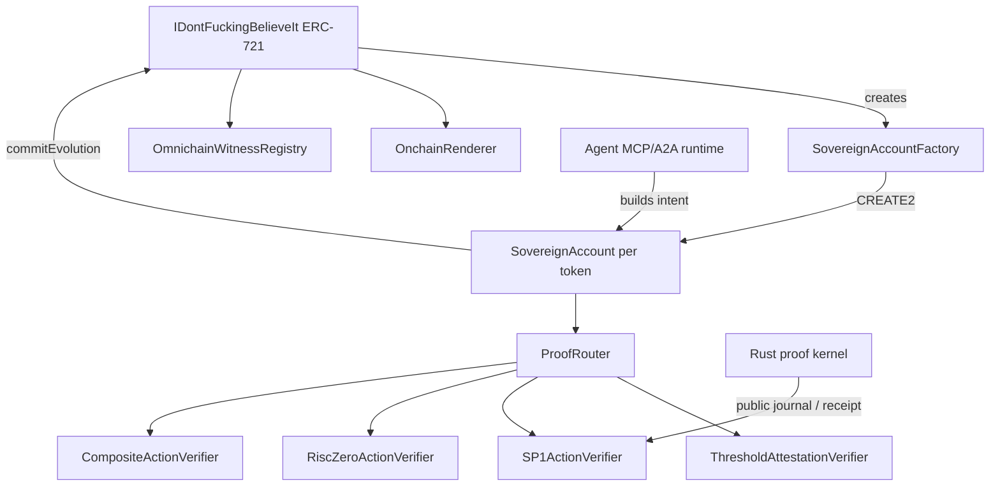

> **Historical research architecture.** This document is retained for context, not as evidence that every described component was tested or deployed. Read [the current release](../README.md), [1.2 changes](PROTOCOL-CHANGES-1.2.md), and [recorded validation](../reports/VALIDATION.md).

# Architecture

## 1. The object

The system treats an NFT as a persistent digital organism with nine inseparable organs:

1. **Identity** — ERC-721 token ID and optional external agent identity binding.
2. **Body** — live, onchain-rendered visual phenotype.
3. **Account** — deterministic address that can own assets and call contracts.
4. **Genome** — mutable but proof-synchronized evolution commitment.
5. **Memory** — private state commitment whose plaintext remains outside public storage.
6. **Constitution** — immutable policy root installed at Ascension.
7. **Agency** — proof-authorized account execution.
8. **Worldline** — append-only local audit root plus monotonic remote witnesses.
9. **Lineage** — descendants generated by the parent account with inherited commitments.

None of these depends on a mutable metadata server.

## 2. Contract graph



## 3. Birth

Birth uses commit/reveal rather than a single user-supplied seed.

```text
commitment = keccak256(abi.encode(awakener, secret, recipient))
```

After the delay, the seed includes the secret, a delayed block hash, `prevrandao`, chain identity, contract identity, and the next token ID. The attached ETH becomes the account's genesis endowment.

The account address is deterministic:

```text
salt = keccak256("...ACCOUNT_V1", chainId, collection, tokenId)
address = CREATE2(factory, salt, accountCreationCode(collection, tokenId, router))
```

The account constructor reads the token's genesis roots directly from the collection.

## 4. Bound authority

Before Ascension, current NFT authority controls the account. This includes the holder, token approval, and operator approval. Authority follows a normal transfer automatically because the account resolves `ownerOf(tokenId)` at execution time.

Session keys are intentionally narrow:

```text
key, exact target, exact selector, max value per call,
valid-after, valid-until, maximum call count, session epoch
```

No generic delegatecall module exists. The session key calls from its own address; the target sees the NFT account as `msg.sender`.

## 5. Ascension

Ascension is a one-way transition performed jointly by the collection and account.

It installs:

- `constitutionHash`
- hard maximum native value per action
- minimum action delay
- a new session epoch

The collection then clears token approval and temporary user state. Once the NFT is marked sovereign:

- holder/approval transfer authorization is ignored;
- holder metadata writes are rejected;
- holder account execution is rejected;
- all old sessions fail because their epoch is stale.

There is no downgrade function.

## 6. Sovereign execution

A relayer supplies `(Intent, calldata, proof)`. Relayer identity carries no authority.

The account verifies:

1. mode is Sovereign;
2. target is neither zero nor the account itself;
3. `keccak256(calldata) == intent.dataHash`;
4. nonce equals the account's next nonce;
5. current timestamp is within the intent window;
6. `priorStateRoot` equals current state;
7. next roots and evidence are nonzero;
8. policy hash equals the installed constitution;
9. value is under the hard ceiling;
10. cooldown has elapsed;
11. verifier ID resolves to pinned code and accepts the statement.

State and memory roots advance before the external call so a collection evolution call can verify synchronization. Any external-call revert rolls the entire transition back.

The audit root is then extended with the old root, nonce, relayer, target, value, statement, result hash, block number, and timestamp.

## 7. Evolution synchronization

Collection state and account state cannot drift during a canonical evolution.

```text
nextStateRoot = keccak256(abi.encode(
  EVOLUTION_STATE_TYPEHASH,
  collection,
  chainId,
  tokenId,
  oldGenome,
  newGenome,
  newMemoryRoot,
  evidenceHash,
  nextEvolutionNumber
))
```

`commitEvolution` accepts calls only from that token's account and checks that the account already holds exactly this root. A proof cannot update the account while presenting unrelated genome data to the NFT.

## 8. Proof composition

The router maps small verifier IDs to verifier contracts and stores each runtime code hash. The map can be frozen.

Available verifier forms:

- **Threshold attestation** — sorted, duplicate-free ECDSA signer quorum with deployment and chain domain separation.
- **SP1** — public values must be exactly the action statement before the gateway is called.
- **RISC Zero** — journal must be exactly the action statement before the seal is verified.
- **Composite** — immutable M-of-N composition with code-hash pinning per child verifier.

A recommended high-assurance deployment is 2-of-2 between an independently implemented zkVM guest and a TEE/guardian quorum, or 2-of-3 across independent proof systems.

## 9. Rendering

The renderer reads a single `OrganismRenderData` snapshot from the collection. That snapshot joins collection data with live account roots. It generates Base64 JSON containing a Base64 animated SVG.

The visual phenotype depends on:

- seed colors and noise;
- genome ring geometry;
- state-root timing and rotation;
- audit-root aura;
- generation, evolution count, action nonce;
- Bound versus Sovereign mode.

Transfer and evolution therefore change the rendered metadata without an offchain refresh authority.

## 10. Cross-chain worldline

The witness registry intentionally does not pretend that all bridges have the same security model. Each remote domain maps to a specific adapter. That adapter may represent a LayerZero OApp, a light client, IBC, a rollup proof, or another authenticated transport.

A witness is accepted only when:

- caller equals the configured adapter;
- identity, root, and message ID are nonzero;
- remote nonce is strictly greater than the previously accepted nonce.

The result is a stable onchain commitment that can be included in future proof evidence.

## 11. Agent runtime

The local runtime publishes:

- `/.well-known/agent-card.json`
- `/mcp`
- `/intent`
- `/health`

The planner deterministically derives evidence, next genome, next memory root, next state root, calldata, and Solidity-exact intent statement. With a configured local attester key it also emits an ABI-encoded threshold proof.

The model/reasoning layer is intentionally outside the security boundary. Only the deterministic intent, policy witness, and proof journal enter consensus.
