# ANIMA — Sovereign Agent Tokens

> **Want to use the graphical app?** This GitHub page is the project's source code, not the app.
> Open the **[ANIMA Sanctuary](https://venividis.github.io/Cutting-edge-technologically-advanced-NFT/)**
> in a new tab. If that link has not been switched on yet, the repository owner can follow the
> plain-English “Put the Sanctuary online” steps below—no command line is required.

**One ERC-721 token = one complete, economically accountable AI agent.**

> **AI agents and integrators:** start with the [machine integration guide](docs/AGENT_INTEGRATION.md),
> [manifest schema](schemas/anima-agent-manifest-v1.schema.json), and
> [example manifest](examples/manifests/base-sepolia-example.json). The public site also serves
> [`llms.txt`](https://venividis.github.io/Cutting-edge-technologically-advanced-NFT/llms.txt).

An identity, a wallet, private state, a declared model, a published leash, and a bond you
can take from it when it fails.

> Status: reference implementation. 27 contracts, 268 tests, 25 review findings fixed.
> Two interchangeable builds of the token — a monolith and an immutable EIP-2535 diamond —
> proved equivalent by running the same suite against both.
> **Live on Base Sepolia** ([token](https://sepolia.basescan.org/address/0x0aeb6f783ebade8fd5ffca74317266d4ea3e71b3)), with a full agent lifecycle run on chain.
> Unaudited; no production deployments.
> Read [Honest limitations](#honest-limitations) before you do anything with real money.

For the threat model, implemented encrypted-message path, and confidential/omnichain execution
roadmap, see **[Privacy architecture](docs/PRIVACY.md)**.

---

## The problem this exists to solve

The pieces for agent-native tokens all shipped. None of them talk to each other.

| Standard | What it gives you | What it leaves out |
|---|---|---|
| **ERC-8004** (Trustless Agents) | identity, reputation, validation registries | no wallet, no economics, no private state, and feedback anyone can mint for the price of gas |
| **ERC-6551** (Token Bound Accounts) | every NFT gets a wallet | nothing agent-specific; a wallet with no limits is a liability |
| **ERC-7857** (AI Agents NFT) | encrypted metadata that re-keys on transfer | no identity, no payments, no accountability; vendor-coupled in practice |
| **ONFT / LayerZero** | move the token across chains | the message carries `(to, tokenId)` — enough for a collectible, not for an agent. It is also one of only two rails that can carry an NFT at all: CCIP, Wormhole NTT, Axelar ITS, ERC-7802 and xERC20 are all amount-typed. |
| **ERC-4907 / 5192 / 2981** | rental, locking, royalties | mutually unaware of each other; royalties are unenforceable by design |

So you can build an agent that has a name, or one that has a wallet, or one that has secrets.
You cannot build one a stranger can safely hire — because nothing binds **identity ↔ wallet ↔
private state ↔ verified work ↔ money ↔ consequences**.

ANIMA is that binding, plus the one primitive genuinely missing from all of it:

> **An agent can only accept work up to what it has staked.**
> Its maximum lie is bounded by its own capital, and you can check that bound before you hire it.

Reputation you can mint for free is worthless. Validation nobody pays for is advisory. A bond
converts "trust me" into a number.

---

## Architecture

```mermaid
graph TB
    subgraph core["Core — the token is the agent"]
        AGENT["<b>AnimaAgent</b><br/>ERC-721 · ERC-8004 identity<br/>ERC-7857 sealed brain<br/>4907 · 5192 · 6454 · 2981 · 4906 · 7572"]
        ACCT["<b>AgentAccount</b><br/>ERC-6551 wallet<br/>session keys · budgets<br/>audit chain · ERC-4337"]
        KEYS["EncryptionKeyRegistry"]
        VERIF["TransferVerifier<br/><i>null · attester quorum</i>"]
        DIA["<b>AnimaDiamond</b> <i>alternate build</i><br/>Core · Agent · Brain · Loupe<br/>EIP-2535, no diamondCut"]
    end

    subgraph acct["Accountability — why anyone should believe it"]
        BOND["<b>BondVault</b><br/>slashable stake"]
        ESC["<b>WorkEscrow</b><br/>hire · deliver · dispute"]
        REP["ReputationRegistry<br/><i>attested vs open</i>"]
        VAL["ValidationRegistry"]
    end

    subgraph mkt["Markets"]
        MARKET["<b>AgentMarket</b><br/>sale · rental<br/>integrity-bound orders"]
        LAUNCH["<b>AgentLaunchpad</b><br/>bonding curve"]
        TOKEN["<b>AgentToken</b><br/>redemption floor"]
        SWAP["AgentSwapRouter<br/>per-token budgets"]
        ROLES["AnimaRoles<br/>ERC-7432 · four roles at once"]
    end

    subgraph reach["Reach"]
        COMMS["AgentComms<br/>priced attention"]
        METER["InferenceMeter<br/>per-call channels"]
        OMNI["OmniAgentHome ↔ Mirror<br/>LayerZero V2"]
        HANDLES["<b>AgentHandles</b><br/>email · domain · DID<br/>mesh peer id"]
        BIND["AnimaBindings<br/>ERC-8217"]
    end

    DIA -.->|same ABI, same state| AGENT
    AGENT -->|derives| ACCT
    AGENT --> KEYS
    AGENT --> VERIF
    ESC -->|locks| AGENT
    ESC -->|reserves / slashes| BOND
    ESC -->|attests| REP
    ESC -->|asks| VAL
    MARKET -->|checks state of| ACCT
    MARKET -->|checks coverage| BOND
    ROLES -->|freezes| AGENT
    LAUNCH --> TOKEN
    TOKEN -->|floor rises| LAUNCH
    SWAP -->|called by| ACCT
    PERPS["<b>AgentDerivativesDesk</b><br/>notional · leverage caps"] -->|called by| ACCT
    HANDLES -->|identifies| AGENT
    METER -->|pays| ACCT
    COMMS -->|pays| ACCT
    OMNI -->|escrows| AGENT
```



---

## What's actually new here

### 1. An agent's leash is public, and it is real

Anyone can read an agent's `AutonomyPolicy` **before** transacting with it: per-transaction
cap, rolling daily cap, target allowlist, expiry, whether delegatecall is permitted. The owner
signs without limits; the agent runs on session keys bounded by all of it.

A guardian can pause — and only pause. It cannot transfer, spend, or un-pause. *A kill switch
that can also steal is not a safety feature.*

### 2. Native-denominated spending limits are a hole, so budgets are per-token

Every "give the AI a spending limit" design caps `msg.value`. An agent swapping a million USDC
carries `value == 0` and sails straight through. `AgentSwapRouter` denominates budgets in the
token, verifies output by **balance delta** rather than the venue's return value, and zeroes
approvals in the same transaction.

### 3. Selling an agent revokes its autonomy

On transfer the operator set is epoch-rolled, and the lease, guardian, bound wallet and policy
are cleared; status drops to `Paused`. The buyer must consciously re-arm it. The alternative —
an agent that keeps executing its previous owner's policy on behalf of its new owner — is how
a treasury disappears.

### 4. Buying an agent binds to its substance, not its id

Between quoting and settling, a seller can empty the agent's wallet, wipe its memory, or pull
its bond — and on a generic marketplace your fill still succeeds. ANIMA orders pin:

- `expectedAccountState` — the ERC-6551 nonce, which the standard defines for exactly this
  purpose and integrators universally ignore;
- `expectedBrainRoot` — a seller who strips the memory invalidates their own order;
- `minBondCoverage` — buying a "bonded" agent whose bond is mid-withdrawal is buying nothing.

### 5. Private state makes an honest promise

Every encrypted-NFT design shares one irreducible flaw: a previous owner who already decrypted
the plaintext keeps it forever. Most paper over it. ANIMA publishes a machine-readable
`SealPolicy` — `None`, `Committed`, `ReKeyed`, `SealedTEE`, `SealedZK`, `Threshold` — that
**starts as the issuer's claim and is overwritten by what a verifier actually certified** on
every sealed transfer. An owner can weaken their claim freely; strengthening it requires a
verifier. Buyers price the residual risk instead of being misled about it.

### 6. Reputation separates claims from evidence

`getSummary` is ERC-8004-compatible and counts everything — treat it as the *upper bound* on an
agent's claimed standing. `getAttestedSummary` counts only feedback from clients who provably
paid, weighted by what they paid. Faking that costs exactly as much as the jobs are worth.

### 7. A launch token with a floor under it

`AgentToken` implements ERC-7641's burn-to-redeem: the price cannot durably trade below
`treasury / totalSupply`, because below it anyone can buy, burn, and take out more than they
put in. Not a buyback someone has to remember to run — an arbitrage that enforces itself. A
share of every trade routes into that treasury, so the floor rises with genuine usage.

### 8. Provenance you can verify at resale

`AgentAccount` keeps a hash chain over every call it has ever executed. A buyer replays the
emitted log off-line and checks it ends at the on-chain root: a seller cannot prune the
embarrassing entries, splice in flattering ones, or reorder history. `InferenceMeter` goes
further — the payment voucher commits to the exact batch of receipts, so the record of what an
agent was asked and what it answered is **bilateral**, not the agent's word about itself.

### 9. A leash that survives leverage

Spot budgets do not bound a leveraged position. An agent with a $1,000 daily limit can post
$1,000 of margin and carry $50,000 of exposure, and every cap in the system reports perfect
behaviour right up until liquidation. That gap matters now that agents reach perpetuals directly
— Coinbase's agent surfaces and Base's DeFi MCP both put perps one tool call away.

`AgentDerivativesDesk` adds notional, margin and leverage caps per market plus a portfolio-wide
collateral cap, and enforces them against **what the position actually became**: collateral at
risk is measured by moving the funds itself, and notional is read from an allowlisted venue
adapter after the trade. A position the desk can see no collateral behind is refused rather than
divided by zero.

### 10. An agent with a real account

Roughly the entire consumer web gates signup on one flow: enter an address, receive a code,
confirm. An agent without an inbox cannot complete it — so it cannot open accounts, recover
them, or receive anything asynchronous. Agent-inbox providers solved the plumbing, and
SPF/DKIM/DMARC already make "this message came from that domain" checkable. What was missing is
the other direction: a way for a *counterparty* to check that an inbox belongs to a given agent
without asking the agent.

`AgentHandles` is that registry — verified email, domain, DID, ENS, social, and libp2p mesh peer
identities, attested by per-kind verifiers, enforced one-agent-per-handle, and **stale the moment
the agent changes hands**, exactly like its autonomy. The mesh peer entry is the interesting one:
a Sovereign Agent Mesh control plane binds a peer id to an OIDC subject at a central identity
provider; publishing the same peer id against the token gives a second, permissionless way to
check it.

### 11. Approvals that expire, and a button to revoke them all

ERC-721's `setApprovalForAll` is unbounded in time, unbounded in scope, and not enumerable —
the direct cause of the largest class of NFT user losses. ICRC-37 and CW-721 both solved it years
ago outside EVM. ANIMA ports it: the standard signature still works, `setApprovalForAllUntil`
time-boxes a grant, and `revokeAllApprovals` kills every outstanding one in a single write —
without needing to remember who they were granted to.

### 12. Omnichain that doesn't launder accountability

An agent's bond and reputation are chain-local claims other contracts hold against it.
Burn-and-mint would strand them behind an id nobody owns — an agent that can leave its
accountability behind by bridging has none. ANIMA escrows on one canonical home chain and
mirrors elsewhere; the message carries the manifest commitment, brain root, model root and seal
policy, so a mirror is a **verifiable replica** rather than a receipt. A busy agent cannot leave
at all.

### 13. Revenue policy that cannot change after the deal

`RevenueRouter` turns an agent's gross earnings into a bounded waterfall: at least 50% remains
operating capital, while explicit shares may fund its redemption treasury, grow slashable bond,
reward a referrer, or support a commons. Policies are owner-bound, wait two days to activate, and
go stale on transfer. Orders commit to the policy *and referrer* before work begins, preventing a
settlement caller from swapping either after the obligation exists. This is opt-in infrastructure,
not a promise that revenue, referrals, or an agent token have economic or legal value.

### 14. Cash in, funded agent out

`FiatMintGateway` lets an approved payment processor fulfil a card or bank payment as one
on-chain operation: mint the NFT to the customer, materialize its ERC-6551 wallet, and transfer
the quoted aUSD (less the disclosed fee) into that wallet. A $1,000 purchase can therefore
deliver 1,000 aUSD before fees, or the explicitly quoted equivalent. Settlement IDs cannot be
replayed, fees have a permanent 10% ceiling, and the customer's `minimumNetAmount` makes the
transaction revert rather than accepting a worse quote.

The contract does **not** pretend a blockchain can verify a bank payment. The allowlisted
processor is the explicit trust boundary and should call `settleAndMint` only after the fiat
provider reports final payment. The configured reserve wallet must hold the aUSD and approve the
gateway; cash proceeds, chargebacks, KYC/AML, sanctions screening, refunds, tax, custody and money
transmission obligations remain with the operator and its regulated payment providers.

### 15. Two builds of the same token, one of which has no ceiling

`AnimaAgent` is 23,971 bytes. EIP-170 allows 24,576. That 605-byte margin is not headroom, it
is a countdown — the next Final standard worth adopting does not fit, and the levers left (drop
the metadata trailer, cut optimizer runs to 1) each cost something permanent to buy a few
hundred bytes once.

So the same token also ships as an **immutable EIP-2535 diamond**: three facets plus a loupe,
wired in the constructor, with **no `diamondCut` function**. Not for upgradeability — that is
precisely the property an agent standard must not have, since a buyer's guarantee that a sale
revokes the seller's session keys is worth exactly as much as the admin key that could remove
it. EIP-2535 provides for this explicitly: *"A diamond that has no external function for
adding, replacing or removing functions is immutable."* Anyone can verify it from an RPC node:
call `facets()`, confirm no selector resolves to `diamondCut`, confirm each facet's bytecode.

| | monolith | diamond |
|---|---:|---:|
| largest deployed unit | 23,971 B | 15,758 B |
| headroom before EIP-170 | **605 B** | **8,818 B**, per facet, and a new facet costs nothing |
| gas per call | — | **+4,300 to +5,400**, flat |

That overhead is measured, not asserted — `test/Gas.test.ts` prints the table over 18 calls and
fails the build if it drifts outside a bound. It is exactly what one `DELEGATECALL` costs: a cold
`SLOAD` of the selector table (2,100) plus a cold account access for the facet (2,600).

Measuring is also what caught the one place it wasn't flat. Moving the token's four `immutable`s
(ERC-6551 registry, account implementation, salt, key registry) into diamond storage cost three
extra cold `SLOAD`s on `accountOf` — **+11,081 gas**, on the hottest cross-contract read in the
protocol, since eight contracts call it on their settlement paths to find where an agent's money
goes. They are now `immutable` per facet again, and the hazard that argued for storage — facets
deployed disagreeing about which registry is canonical — is removed by the diamond's constructor
refusing to deploy unless every facet reports the same config hash. A check at construction beats
a cost on every settlement.

Storage is ERC-7201 namespaced (`anima.storage.core`, `anima.storage.diamond`), and everything
ERC-721/2981/712/Ownable needs lives in OpenZeppelin's own namespaces — so the regions are
disjoint by construction rather than by review. The transfer hook, the authorisation
predicates and the approval store live in one shared base, so no facet can hold a different
opinion about who controls an agent.

**The equivalence is tested, not asserted.** The facets partition the monolith's ABI — the cut
is derived from it at deploy time and refuses to build if a function goes unrouted or a facet
invents one — so every one of the 199 protocol tests runs unmodified against either build via
`ANIMA_IMPL=diamond`. On top of that, `Diamond.test.ts` drives an identical agent through both
and asserts their ERC-5646 fingerprints — one hash over the whole of an agent's mutable
state — are byte-identical.

---

## Standards: adopted, adapted, rejected

**Implemented:** ERC-721, ERC-165, ERC-712, ERC-1271, ERC-2981, ERC-4337, ERC-4906, ERC-4907,
ERC-5192, ERC-5646, ERC-6454, ERC-6492, ERC-6551, ERC-7201, ERC-7432, ERC-7572, ERC-8004
(Identity + Reputation + Validation), ERC-8126, ERC-8217, EIP-2535 — plus expiring, revocable approvals
ported from ICRC-37 and CW-721, which EVM has no equivalent of.

The full source-by-source review, including ONFT and the overloaded iNFT label, is in
[`docs/NFT_STANDARDS_RESEARCH_2026-09-02.md`](docs/NFT_STANDARDS_RESEARCH_2026-09-02.md).

**Adapted, not copied:** ERC-7857 (the proof-and-hash model, not the vendor ABI), ERC-7641
(the redemption floor, not the snapshot machinery), ERC-8196 (the audit chain), ERC-8183 (the
escrow state machine).

**Deliberately rejected**, with reasons in the code:

- **ERC-721C / transfer validators.** The only thing that actually enforces royalties in 2026,
  at the cost of being untradeable on Blur and most aggregators, plus a hard runtime dependency
  on a validator you don't control. ANIMA captures value where it controls the chokepoint —
  escrow fees, launchpad fees, metering — and treats ERC-2981 as a declaration, which is all its
  own abstract ever claimed it was.
- **ERC-6059.** Superseded by its own authors; its published interfaceId matches neither its
  printed interface nor anything RMRK deploys.
- **ERC-4519.** `userOf` collides with ERC-4907 at the selector level with different semantics.
- **ERC-3525.** Overloads `balanceOf` and `approve` against ERC-721 — the most dangerous ABI
  collision in the NFT space.

---

## Honest limitations

Stated here rather than buried, because a standard that hides them is worse than useless.

- **Unaudited.** 268 tests and an adversarial review pass are not an audit.
- **Sealing protects future state, not past.** A prior owner who already exported plaintext
  keeps it. No cryptography fixes this; `SealPolicy` exists so you can price it.
- **The attester quorum is a trust assumption.** Collusion of `threshold` attesters forges a
  re-key, and a hardware break in the enclave family breaks the guarantee.
- **Bridging does not move the agent's wallet.** The ERC-6551 account is derived from the home
  chain and home contract. Native balances are checked before departure; ERC-20 balances
  *cannot be enumerated on-chain and are not checked* — the departure event publishes the
  account address so a front-end can look, and every integrator should.
- **The fair-launch window raises a sniper's cost; it does not defeat a funded sybil.**
- **Off-chain delivery is the transport's job.** `AgentComms` gives authenticated identity,
  priced attention and refunds. It does not give ordering or delivery guarantees, and a
  contract that claimed to would be lying.
- **LayerZero security rests on the DVN configuration set at the endpoint**, not in this
  repository. A deployment that leaves it on defaults has delegated its security to whoever the
  defaults name.

---

## Live on Base Sepolia

The diamond build is deployed and the whole agent lifecycle has been run against it — not
simulated. Total cost of deploying the protocol: **0.00628 ETH**.

| | |
|---|---|
| **Token** (immutable diamond) | [`0x0aeb6f78…3e71b3`](https://sepolia.basescan.org/address/0x0aeb6f783ebade8fd5ffca74317266d4ea3e71b3) |
| Facets | core [`0x4A81…8c47`](https://sepolia.basescan.org/address/0x4A815892c26eb5Ab35b17fd85b881d7610428c47) · agent [`0x79c4…b545`](https://sepolia.basescan.org/address/0x79c4Fe69D445dcf8c72392Ea3554aeb423EAb545) · brain [`0xEebD…21c0`](https://sepolia.basescan.org/address/0xEebD273549156F636c6FF24D7DebC115aFFf21c0) · loupe [`0xda7d…aBa2`](https://sepolia.basescan.org/address/0xda7d5f48b94067f1F3b35fe2c52e0c03ba2AaBa2) |
| Accountability | bonds [`0xcfd3…cC76`](https://sepolia.basescan.org/address/0xcfd3E22a9b8B419fE53E47886b2bf621d327cC76) · escrow [`0xFBA8…af4A`](https://sepolia.basescan.org/address/0xFBA84694C5F0Ee5A33fad6D732f327db7644af4A) · reputation [`0xb201…0579`](https://sepolia.basescan.org/address/0xb201eF54e44A81c4e141ced20f2fFCBF06350579) · validation [`0x0eFc…162d`](https://sepolia.basescan.org/address/0x0eFca108B2A456649D40F4F69DD0FFc7dd69162d) |
| Markets & reach | market [`0x2802…7cD0`](https://sepolia.basescan.org/address/0x280296FEaA460354e1d86dAF0f3afCA631927cD0) · comms [`0xD008…F34b`](https://sepolia.basescan.org/address/0xD0081791398a0f5504672a0cb46afC733feCF34b) · meter [`0x3657…7A58`](https://sepolia.basescan.org/address/0x3657704749d06d38B222024393cB35d3D83c7A58) · handles [`0x9e8c…CDE6`](https://sepolia.basescan.org/address/0x9e8c0dE328201Ed7Ee4f41a16b9A829aE933CDE6) · roles [`0xF4dA…6F8f`](https://sepolia.basescan.org/address/0xF4dA6c25F2972B0833BaCCC8235773ea1dF36F8f) |

Three things only a real chain could settle, now settled: `TSTORE` works (fourteen contracts use
transient storage), the token points at the **canonical** ERC-6551 registry rather than a mock, and
EntryPoint v0.7 is wired in as `AgentAccount`'s immutable so the ERC-4337 path is real.

### Agent #2, its whole life, on chain

`scripts/testnet-scenario.ts` — 21 transactions, every one linkable:
[mint with a sealed brain](https://sepolia.basescan.org/tx/0x533cc70098a674e45cec67a4d6ee8734451881c87c29c011ce04869a8508a248) →
[commit its manifest](https://sepolia.basescan.org/tx/0x7df03fd45d4b3a714b9fe70481953cda5476b47265708c417298c7080c1e012c) →
[deploy its ERC-6551 wallet](https://sepolia.basescan.org/tx/0xf483609b2cb43884baf31604a552fd671514f8543e55cf070bbc4aa4ed9eb8e7) at the address predicted before deployment →
[publish the leash](https://sepolia.basescan.org/tx/0x16596d3c8ac809346c48cafe3a4c33f0c9e85f7a948669cfc0c4b5b61bb68184) →
[post a 2,000 aUSD bond](https://sepolia.basescan.org/tx/0x49ca96b351442d0ec891562a494364ca2d00cc202604fe9c9d9c0d16f03e0777) →
[hired for 500 aUSD](https://sepolia.basescan.org/tx/0xb30be0a7b4dab0b7e8dcc3eea47cc931b0b5783ef83850ee5fee33d3a0bcf388), which **locks the token** →
[learns](https://sepolia.basescan.org/tx/0x83cc5e99214a86f1a8cdeb54fde5a49559af33b62573b367f50a8a3be22436d9) →
[delivers](https://sepolia.basescan.org/tx/0xe2723c7deb707f47bb76e667e76c0f783aee3cc40bcc454e163334e95b08d9c3) →
[paid and rated 92](https://sepolia.basescan.org/tx/0x3c37f470e8c8dbcac706532602ac0960c3a308547e359bf94cd243227a4bf7f0) →
[stakes its own earnings](https://sepolia.basescan.org/tx/0xaafddec2f68db19d022bf44a1d2624972cad902fab61073a1a5fdf85446cef08) →
[charges for attention](https://sepolia.basescan.org/tx/0xad79b8f1e785a7346a1b3c5c6797ce00855dc5f6fd3cd05c9e1e72236f08d6ce) →
[leased out](https://sepolia.basescan.org/tx/0x9371be547c07a9c6d327bce9121f853631a43f44d7fa9acd36bb9168c326adec) →
[**sold**](https://sepolia.basescan.org/tx/0x6d2a02e0a79646b3f7d8196064f31518f4a8187be4733df50792bd82433c0245).

Two moments are the whole point of the standard, and both happened on a chain nobody controls:

**While it owed work, it could not be sold.** The transfer was refused with `AgentLocked`.

**When it was sold, the seller's authority died with the sale.** Guardian cleared, ERC-4907
tenant evicted, autonomy policy zeroed, status forced to `Paused`, every operator revoked by an
epoch roll, and the ERC-5646 fingerprint changed accordingly. What the buyer kept was the agent
itself: same wallet address, brain at epoch 2, its attested review, and **2,495 aUSD of bonded
collateral — including the 495 it earned and staked itself.** Collateral belongs to the agent, so
it changes hands with it.

### An agent crossed chains, and came back

`scripts/testnet-omni.ts` — agent #5 ("Nomad") went **Base Sepolia → OP Sepolia → Base Sepolia**
over LayerZero V2. A real DVN attested each packet; a real executor delivered it. Nothing mocked.

| | |
|---|---|
| `OmniAgentHome` (Base Sepolia, eid 40245) | [`0xbaA01630…a0e169`](https://sepolia.basescan.org/address/0xbaA01630c858EF1DA96bb47FA726043afea0e169) |
| `OmniAgentMirror` (OP Sepolia, eid 40232) | [`0xB97ea50e…732bc6d`](https://sepolia-optimism.etherscan.io/address/0xB97ea50e956E36606eC5DD159dC7f25CA732bc6d) |
| [Outbound](https://testnet.layerzeroscan.com/tx/0xeadc3e3344faa3708b3e56bbc158f744804e78ae0eba1489e7de545aa68c80f0) | 0.0000996 ETH to carry an agent across |
| [Return](https://sepolia-optimism.etherscan.io/tx/0xf2f329de7aba467d459e19fe6f4d696230b9de27befeb4e170e601a8840eadac) | delivered in about a minute |

What arrived was a **verifiable replica, not a receipt**: its `brainRoot` and `manifestHash` were
byte-identical to what left home, at the same `brainEpoch`, and it answers `isReplica() == true`
about itself so no one mistakes it for the agent. Meanwhile the real token sat in escrow at the
bridge on its home chain — never burned, so the bond and reputation other contracts hold against
it stayed exactly where they were. On the return leg the replica was burned and the token came out
of escrow, brain intact. An agent cannot exist twice, and cannot leave its accountability behind.

### The registries, exercised

`scripts/testnet-modules.ts` — 16 more transactions across the three registries that a deployment
alone proves nothing about:

- **`AgentHandles`.** An agent attests an email inbox with an on-chain verifier and evidence hash,
  and a second agent [is refused the same one](https://sepolia.basescan.org/tx/0xec4ec73cc2ba190bdbd35ba32c3be378cf6da98848dfc41a2e1cd25af8e0d101)
  (`HandleTaken`). One inbox, one agent — otherwise "who controls this address" has no answer.
- **`AnimaRoles` (ERC-7432).** Operator, payer and auditor held *simultaneously* by three different
  addresses with three different expiries — which ERC-4907's single `user` slot cannot express.
  Revoking all three deliberately does **not** release the token; [`unlockToken`](https://sepolia.basescan.org/tx/0x4bec4362b86c2dad660186d4ee2598c8d16db80a46658acce26a2106b694cad9)
  does, permissionlessly, and only once nothing irrevocable is outstanding. Splitting the two means
  a grantee cannot strand the token and an owner cannot yank it back mid-grant.
- **`InferenceMeter`.** A payer opens a channel, signs a real EIP-712 voucher for a running total,
  and the agent redeems it into its own wallet — twice, at 120 then 300 aUSD. Replaying the earlier
  voucher is refused, because vouchers are cumulative rather than additive.

Not run on chain, and deliberately: the launchpad, swap router and derivatives desk each need a
venue — a liquidity deployer, a DEX, a perpetuals adapter — and on a testnet those are mocks
whichever chain they sit on, so running them there would prove less than it appears to.

The aUSD here is a faucet token with a permissionless `mint`; the whole deployment is a burner and
carries no value.

## Getting started

### Mint and enter the human sanctuary (Base Sepolia)

This is testnet-only: the NFT and test ETH have no monetary value. Use a separate test wallet, not a
wallet that holds valuable assets.

1. Install MetaMask or Rabby, create/select a test wallet, and add **Base Sepolia** (chain ID
   `84532`, currency `ETH`, RPC `https://sepolia.base.org`, explorer
   `https://sepolia.basescan.org`). Most wallets add it automatically when the Sanctuary requests it.
2. Get a small amount of Base Sepolia ETH from the
   [Coinbase Developer Platform faucet](https://portal.cdp.coinbase.com/products/faucet). It is only
   needed for gas; do not send real ETH to the testnet address.
3. Start the interface:

   ```bash
   npm install
   npm run ui
   # open http://localhost:5173
   ```

4. Select **Enter sanctuary**, then **I need to mint one first**. Approve the wallet connection and
   network switch, give the agent a name, inspect the simulated request, and confirm the mint in the
   wallet. Wait for “Agent # is alive”; the new on-chain card then appears automatically.
5. Open the card's **Command Chamber**. **Materialize wallet** deploys its deterministic ERC-6551
   account. **Awaken agent** changes it from Dormant to Awake; **Pause safely** stops autonomous use.
   Each write is simulated first and still requires an explicit wallet confirmation.

On later visits, choose **Enter sanctuary → Connect wallet** and the page rediscovers every ANIMA
held by that address. No connection is needed to inspect a known token ID. The console shows the
agent's lifecycle, memory seal and epoch, ERC-6551 account, autonomy horizon, and ERC-5646 state
fingerprint, with a direct BaseScan provenance link. The page uses the wallet provider already in
the browser and never asks for or handles a private key.

The current console targets the historical Base Sepolia deployment in `deployments/84532.json`.
The repository's `scripts/testnet-mint.ts` is for deployment operators: it intentionally refuses a
key that does not own the matching deployment record, so ordinary holders should use the Sanctuary.

#### Put the Sanctuary online from GitHub (repository owner, no terminal)

The screen showing folders such as `contracts`, `docs`, and `src` is GitHub's **code page**. It cannot
run the graphical app by itself. This repository includes a publishing workflow that turns the app
into a normal website after these one-time clicks:

1. Make sure the Sanctuary changes have been merged into the `main` branch.
2. At the top of the GitHub repository, select **Settings**. If the window is narrow, first select
   the **…** menu and then **Settings**.
3. In the left-hand menu, select **Pages**.
4. Under **Build and deployment**, set **Source** to **GitHub Actions**. Do not select “Deploy from a
   branch.”
5. Return to the repository and select **Actions** at the top.
6. In the left-hand list, select **Publish the ANIMA Sanctuary**.
7. Select **Run workflow**, leave the branch as `main`, and select the green **Run workflow** button.
8. Wait for the workflow to show a green check mark. Open it and select the website address shown
   under **deployments**, or visit
   `https://venividis.github.io/Cutting-edge-technologically-advanced-NFT/`.

After that first setup, every change merged into `main` republishes the site automatically. Visitors
only need the website link; they do not need GitHub, Node.js, a terminal, or a copy of the repository.

If GitHub says Pages is unavailable, check the repository's plan/privacy settings. A private
repository may require a paid GitHub plan or an administrator to permit Pages. Making the source
repository public also permits a public Pages site, but do that only if the source is intended to be
public.

```bash
npm install
npx hardhat build      # solc 0.8.28, viaIR, cancun
npx hardhat test       # 268 tests against the monolith
npm run test:diamond   # the same 268 against the EIP-2535 build
npm run test:both      # both, in sequence
```

If Hardhat reports `HHE905` behind a corporate or container proxy while `curl` still has network
access, prime its standard compiler cache and retry:

```bash
npm run compiler:cache
npm run build
npx hardhat test test/Sdk.test.ts
```

The cache command downloads both the native and WASM solc 0.8.28 builds from Solidity's official
binary repository and verifies each published SHA-256 checksum. It does not modify `node_modules`
or commit compiler binaries. In a truly offline environment, populate the same cache in the CI
image or restore it from a trusted cache artifact before running Hardhat.

Docs: [agent integration](docs/AGENT_INTEGRATION.md) · [architecture](docs/ARCHITECTURE.md) ·
[the standard](docs/SPEC.md) · [security model](docs/SECURITY.md) · [deploying](docs/DEPLOYMENT.md)

Overview page: <https://claude.ai/code/artifact/38d30b21-bce9-4e98-9944-b2ad85eba5e4>

## Give an agent a sovereign web name

Run the guided terminal and type `/bind`:

```bash
export ANIMA_PRIVATE_KEY=0x...   # current agent controller and ENS owner; never committed
export ANIMA_RPC_URL=https://... # the agent's home chain
export ENS_RPC_URL=https://...   # Ethereum, where the .eth name lives
npm run anima

anima> /bind
```

The wizard verifies that the signer controls the agent, derives its ERC-6551 account, and then
offers to set the ENS address, `com.anima.agent`, `com.anima.account`, HTTPS fallback, and IPFS
`contenthash` records atomically through the ENS resolver's `multicall`. For a second-level `.eth`,
the current NFT owner can optionally transfer the ENS NFT into the agent account: the name then
stays in the same account while control of that account follows ANIMA ownership. Custody is only
available when the agent's home chain is Ethereum mainnet; cross-chain agent accounts cannot
control mainnet assets. An operator or tenant may update records only when separately authorised
by ENS, but cannot choose permanent custody. This custody step is deliberately opt-in and requires
typing the name again.

ENS is naming, not storage. Pin the exact GUI CID with multiple independent providers (and ideally
an archival network) before binding it. The HTTPS URL is a compatibility route; the ENS contenthash
is the independently recoverable route. The terminal never prompts for, prints, or stores a private
key—it only reads `ANIMA_PRIVATE_KEY` from the process environment.

## License

MIT
